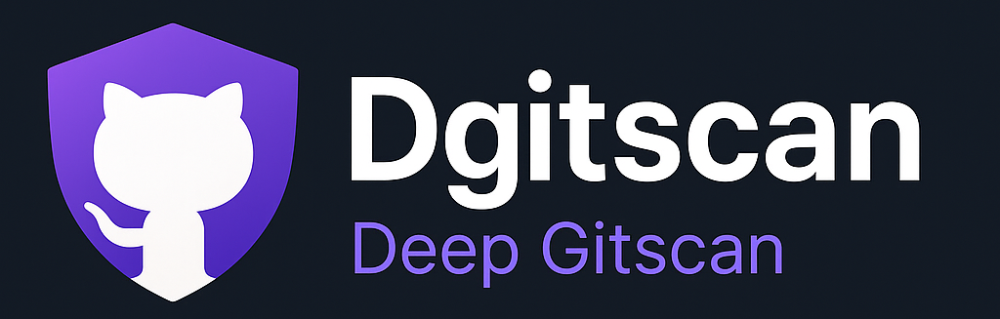

# Dgitscan - Deep Gitscan

<p align="center">
  
</p>


> **Dgitscan** is a powerful GitHub reconnaissance tool that scans raw GitHub content for exposed subdomains and sensitive credentials related to a target organization. Built for bug bounty hunters, red teamers, and cybersecurity researchers, it combines subdomain enumeration, secret detection, entropy filtering, and DNS resolution in one streamlined CLI utility.

---

## 🚀 Features

- 🔍 **Subdomain Discovery**: Detects subdomains of a target domain embedded in GitHub-hosted source code.
- 🔐 **Credential Detection**: Finds hardcoded secrets using signature-based matching (API keys, tokens, passwords, private keys, etc).
- 🌐 **Live DNS Check**: Confirms if discovered subdomains resolve.
- 📦 **Modular Signature Engine**: Easily extendable via YAML rule files.
- 📁 **Output in JSON**: Results stored in `output/{domain}.json`

---

## 📦 Installation

```bash
# Clone the repository
$ git clone https://github.com/yourname/dgitscan.git
$ cd dgitscan

# Install Python dependencies
$ pip install -r requirements.txt
```

---

## ⚙️ Usage

```bash
python github.py -d example.com
```

### Options:

| Option           | Description                                         |
| ---------------- | --------------------------------------------------- |
| `-d`, `--domain` | Target domain to scan (required)                    |
| `--silent`       | Suppress console output                             |

---

## 🧩 Signature Customization

Secret detection patterns are defined in `signatures.yaml`. You can:

- Add new types
- Adjust regex patterns
- Set custom risk weights

```yaml
signatures:
  AWS Access Key:
    pattern: "AKIA[0-9A-Z]{16}"
    weight: 30
  Google API Key:
    pattern: "AIza[0-9A-Za-z\-_]{35}"
    weight: 25
```

---

## 📂 Output

Results are saved as:

```bash
output/example_com.json
```

Each finding includes:

- Subdomain
- Source URL
- DNS live check
- Risk score
- Leak types & sample values
- Query string leaks (if found)

---

## 🛠 Future Enhancements

- GitHub code search API integration
- CSV/HTML report exports
- Web UI for exploring findings

---

## 🧑‍💻 Author

**Dgitscan** is crafted with ❤️ for offensive security research.

Feel free to contribute, suggest improvements, or fork your own version.

---

## 📄 License

MIT License. See `LICENSE` file for details.

